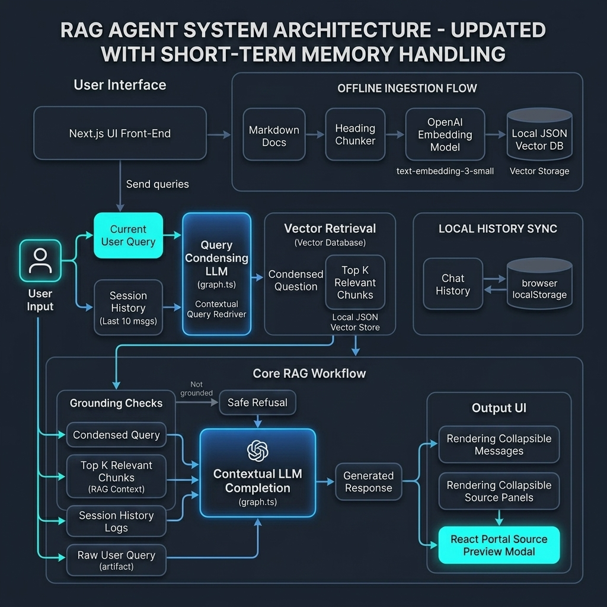

# 🤖 FinPilot Knowledge Bot

FinPilot Knowledge Bot is a lightweight, inspectable Retrieval-Augmented Generation (RAG) assistant built for **FinPilot Analytics** (a fictional financial technology company). The bot is designed to answer internal queries regarding compliance policies, leave schedules, support tickets targets, and product summaries.

---

## 🌟 Core Features

- **Query Condensing & Short-Term Memory:** Retains conversation context by sending the last 10 messages of the session history to the backend. Follow-up queries containing pronouns (e.g. *"Explain the second one more"* or *"Which products does it offer?"*) are automatically rewritten by the LLM into standalone queries before searching the index.
- **Local JSON Vector DB:** Calculates semantic similarity against calculated OpenAI embeddings stored inside `chroma/vector_store.json` using custom cosine similarity dot-product checks, resolving the setup complexity of a Dockerized Chroma server.
- **Collapsible UI Panels:** analyst and assistant message panels can be toggled collapsed/expanded dynamically. When collapsed, message items display a truncated one-line content preview. The reference Sources list is also collapsible and displays reference counts (e.g. `Sources (6)`).
- **Viewport-Centered Source Preview Modal:** Displays full document chunk text along with context location breadcrumbs. Rendered using a **React Portal** directly under `document.body` to resolve centering issues on parent layouts using `backdrop-filter`. Key bindings (`Escape` key), background backdrop clicks, and body scroll-locking are supported.
- **Structured Markdown Parsing:** Features a zero-dependency bold markdown formatter (`renderMarkdown`) to render `**bold**` headers inside chat text bubbles and preview modals without adding heavy external markdown parser packages.
- **Strict Grounding Refusals:** Refuses to answer queries outside the knowledge base scope with a clean uncertainty message (instead of hallucinating information) when the vector similarity score is low or when the LLM returns `[NOT_FOUND]`.

---

## 📁 Repository Structure

```
finpilot-knowledge-bot/
├── app/
│   ├── api/
│   │   └── chat/
│   │       └── route.ts        # API Route that parses query and history parameters
│   ├── page.tsx                # Main app router viewport
│   ├── layout.tsx
│   └── globals.css
│
├── chroma/
│   └── vector_store.json       # Local JSON database containing embedded chunks
│
├── components/
│   ├── chat.tsx                # Main Chat interface, state logic, collapsibles, and portal modal
│   └── source-card.tsx         # Standalone reference source card component
│
├── lib/
│   ├── types.ts                # Shared TypeScript models (Source, ChatResponse, etc.)
│   ├── openai.ts               # OpenAI client configuration singleton
│   ├── chunk.ts                # Markdown chunking script that compiles header paths
│   ├── ingest.ts               # Core logic to fetch embeddings and populate JSON database
│   ├── retrieval.ts            # Cosine similarity matching (top K=15 matches)
│   └── graph.ts                # Graph controller, query rewriting, system grounding prompts
│
├── scripts/
│   ├── ingest-docs.ts          # CLI runner to trigger ingestion (loads Next.js env configuration)
│   └── reset-chroma.ts         # Utility to wipe chroma/vector_store.json
│
├── docs/                       # Internal documents directory (leave rules, compliance, overview, etc.)
│
├── reports/                    # Visual diagrams detailing system architectures
│   ├── system_flowchart.png
│   ├── agent_flowchart.png
│   └── agent_design_flowchart.png
│
├── agentic-brain/              # Technical memory logbooks and task logs
│   ├── PROJECT_BRIEF.md
│   ├── AGENT_CONTEXT.md
│   ├── MEMORY.md
│   ├── TASKS.md
│   └── EVALS.md
```

---

## 🚀 Quick Start Guide

### 1. Install Dependencies
Clone the repository, navigate to the directory, and install npm modules:
```bash
npm install
```

### 2. Configure Environment Variables
Create a `.env.local` file in the root directory:
```env
OPENAI_API_KEY="your-openai-api-key-here"
# Optional: override default OpenAI model (defaults to gpt-4o-mini)
OPENAI_MODEL="gpt-4o-mini"
```

### 3. Run Document Ingestion
Ingest the markdown documents from `/docs` to build the local JSON vector store:
```bash
npx tsx scripts/ingest-docs.ts
```

### 4. Launch the Development Server
```bash
npm run dev
```
Open `http://localhost:3000` in your web browser.

## 📊 Flowcharts & Diagrams

We have documented the architectures under the `reports/` folder. The diagrams are embedded below:

### 1. Agent Design Flowchart

*Shows the UI layout design mapped to stateless memory handling.*

---

## 🧪 Evaluation Framework
To evaluate grounding correctness, citation rules, and memory transitions, check out the evaluation scenarios defined in [agentic-brain/EVALS.md](file:///d:/Projects/active/Soleymani/finpilot-knowledge-bot/agentic-brain/EVALS.md).
